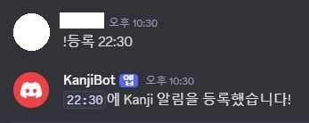
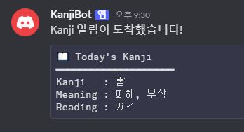
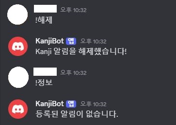
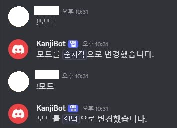
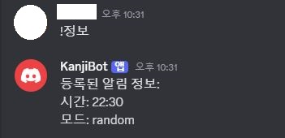
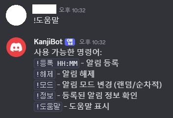

# 🈶 KanjiBot
### 주제(서비스명): Discord Bot (KanjiBot)
    매일 랜덤으로 하나의 일본어 한자를 디스코드 채널에 전송해주는 자동화 봇입니다.

</br>

# 🛠️ 기술 스택 & 개발 환경
- Language: Java 17
- Framework: Spring Boot 3.4.5
- Scheduler: Spring Batch
- ORM: MyBatis
- Database: MySQL
- Build Tool: Gradle
- API 연동: DeepL Translation API (Free Tier)
- 디스코드 메시지 전송: Java Discord API (JDA)
- 한자 데이터셋: Kanjidic2

</br>

# 📅 개발 기간
- 25.05.08 ~ 25.05.20

</br>

# ✨ 주요 기능
- 매일 지정한 시간에 Discord 채널로 Kanji 발송
- 의미(meaning)가 영어일 경우 DeepL API를 활용해 한국어로 자동 번역
- 오픈소스 Kanjidic2를 활용한 약 8000개의 한자 데이터 및 채널 데이터 DB 관리

</br>

# 🗄️ DataBase Structure


</br>

# Index
[1. 프로젝트 요약](#1-프로젝트-요약)  
[2. 주요 기능 소개](#2-주요-기능-소개)  
[3. 기능 동작 예시](#3-기능-동작-예시)  

</br>

# 1. 프로젝트 요약
- KanjiBot은 Discord 사용자에게 매일 한 번 일본어 한자를 전송하는 봇입니다.
- 한자의 의미가 영어일 경우 DeepL API를 통해 자동으로 번역하고, Discord 채널로 메시지를 전송합니다.
- 각 채널마다 전송 시간과 방식(랜덤/순차)을 개별 설정할 수 있어 다양한 스케줄 관리가 가능합니다.

</br>

# 2. 주요 기능 소개
## 📆 매일 주기적 Kanji 전송
- @Scheduled(cron = "0 */30 * * * *")
→ 매 30분마다 실행
- 현재 시각(HH:mm)과 일치하는 채널을 조회하여 전송 실행
- send_mode가 random이면 무작위, sequential이면 순차적으로 전송됨
- count_number로 순차 인덱스 관리
```java
kanji = getKanjiByRandom(); // random 모드
kanji = getKanjiById(index); // sequential 모드
```

</br>

## 🌍 DeepL API를 활용한 자동 번역
- 파싱한 한자 데이터셋의 의미(meaning) 필드에 한글이 포함되지 않을 경우 영어로 간주
- DeepL API를 사용해 한국어로 번역
- 번역된 의미는 DB에 다시 저장하여 재사용
```java
if (!meaning.matches(".*[ㄱ-ㅎㅏ-ㅣ가-힣]+.*")) {
    meaning = deepLTranslate.translate(meaning, "EN", "KO");
    kanjiMapper.updateKanjiMeaning(kanji.getId(), meaning);
}
```

</br>

## 💬 Discord 메시지 전송
- 메시지는 Discord의 Markdown 문법을 사용한 코드 블록 형태
```markdown
📖 Today's Kanji
━━━━━━━━━━━━━━━━━━━━
Kanji   : 害
Meaning : 피해, 부상
Reading : ガイ
```

</br>

# 3. 기능 동작 예시
## KanjiBot 전송 시간 등록


## KanjiBot 알림


## KanjiBot 알림 해제


## KanjiBot 전송모드 변경


## KanjiBot 채널 알림 정보


## KanjiBot 도움말

